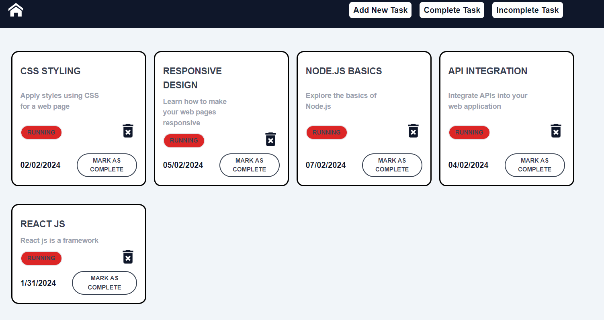

# React Task Tracker
:rocket: [Link to website][https://intern-task-ruby.vercel.app/]

### `All Task`
Display a list of tasks with their respective details (task name, date added, status).

### `Add Task:`

Add Task: Include a form or input field to add new tasks to the list. Tasks should have at least a name and a date added.

### `removeTask`

Delete Task: Provide a way to delete tasks from the list.
### `Local Storage:` Implement local storage to persist tasks even when the page is refreshed.

### `Mark as Completed:`

Mark as Completed: Allow users to mark tasks as completed. Completed tasks should be visually distinct from incomplete ones.

### `Drag and Drop`

